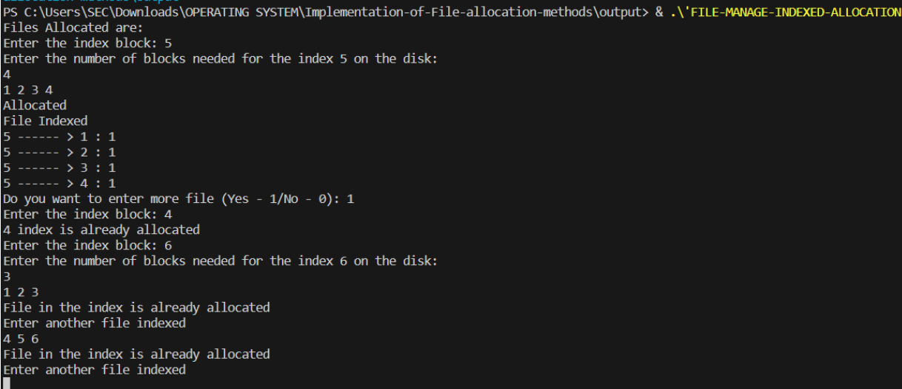

# OS-EX.12-IMPLEMENTATION-OF-FILE-ALLOCATION-METHODS

## AIM
To implement file management using sequential list.

## ALGORITHM
Step 1: Start the program.
Step 2: Get the number of memory partition and their sizes.
Step 3: Get the number of processes and values of block size for each process.
Step 4: First fit algorithm searches all the entire memory block until a hole which is big enough is encountered. It allocates that memory block for the requesting process.
Step 5: Best-fit algorithm searches the memory blocks for the smallest hole which can be allocated to requesting process and allocates it.
Step 6: Worst fit algorithm searches the memory blocks for the largest hole and allocates it to the process.
Step 7: Analyses all the three memory management techniques and display the best algorithm which utilizes the memory resources effectively and efficiently.
Step 8: Stop the program.

## PROGRAM
```
#include < stdio.h>
#include<conio.h>
void main()
{
int f[50], i, st, len, j, c, k, count = 0;
clrscr();
for(i=0;i<50;i++)
f[i]=0;
printf("Files Allocated are : \n");
x: count=0;
printf(“Enter starting block and length of files: ”);
scanf("%d%d", &st,&len);
for(k=st;k<(st+len);k++)
if(f[k]==0)
count++;
if(len==count)
{
for(j=st;j<(st+len);j++)
if(f[j]==0)
{
f[j]=1;
printf("%d\t%d\n",j,f[j]);
}
if(j!=(st+len-1))
printf(” The file is allocated to disk\n");
}
else
printf(” The file is not allocated \n");
printf("Do you want to enter more file(Yes - 1/No - 0)");
scanf("%d", &c);
if(c==1)
goto x;
else
exit();
getch();
}
```

## OUTPUT


## RESULT
Thus, file management using sequential list is implemented successfully.

## AIM
To implement file management using indexed list.

## PROGRAM
```
#include<stdio.h>
int main()
{
int n,m[20],i,j,ib[20],b[20][20];
printf("Enter no. of files:");
scanf("%d",&n);
for(i=0;i<n;i++)
{ 
printf("Enter index block :",i+1); 
scanf("%d",&ib[i]);
printf("Enter blocks occupied by file%d:",i+1); 
scanf("%d",&m[i]);
printf("enter blocks of file%d:",i+1); 
for(j=0;j<m[i];j++) 
scanf("%d",&b[i][j]);
} printf("\nFile\t index\tlength\n"); 
for(i=0;i<n;i++) 
printf("%d\t%d\t%d\n",i+1,ib[i],m[i]); 
printf("blocks occupiedare:"); 
for(i=0;i<n;i++)
{ printf("fileno%d",i+1);
for(j=0;j<m[i];j++)
printf("\t%d--->%d\n",ib[i],b[i][j]);
printf("\n");
}
}
```

# OUTPUT


## RESULT
Thus, file management using indexed list is implemented successfully.

## AIM
To implement file management using linked list.

## PROGRAM
```
#include <stdio.h>
#include <stdlib.h>
int main(){
    int f[50], p, i, st, len, j, c, k, a;
    for (i = 0; i < 50; i++)
        f[i] = 0;
    printf("Enter how many blocks already allocated: ");
    scanf("%d", &p);
    printf("Enter blocks already allocated: ");
    for (i = 0; i < p; i++) {
        scanf("%d", &a);
        f[a] = 1;
    }
x:
    printf("Enter index starting block and length: ");
    scanf("%d%d", &st, &len);
    k = len;
    if (f[st] == 0)
    {
        for (j = st; j < (st + k); j++){
            if (f[j] == 0){
                f[j] = 1;
                printf("%d-------->%d\n", j, f[j]);
            }
            else{
                printf("%d Block is already allocated \n", j);
                k++;
            }
        }
    }
    else
        printf("%d starting block is already allocated \n", st);
    printf("Do you want to enter more file(Yes - 1/No - 0)");
    scanf("%d", &c);
    if (c == 1)
        goto x;
    else
        exit(0);
    return 0;
}
```

## OUTPUT


## RESULT
Thus, file management using linked list is implemented successfully.
